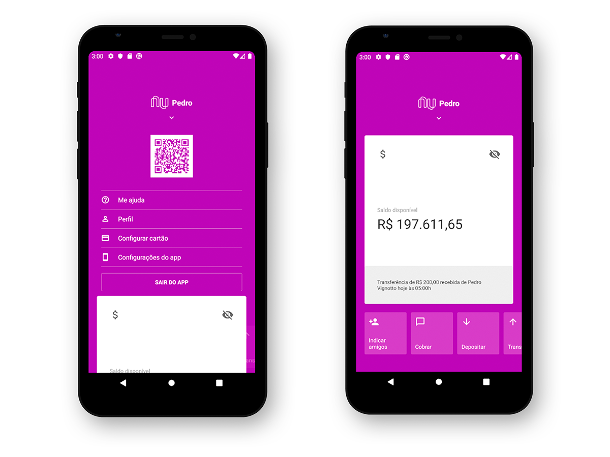

<h1 align="center">
    
</h1>

  <a href="#mortar_board-instalacao-e-execucao">Instação e execução</a>&nbsp;&nbsp;&nbsp;|&nbsp;&nbsp;&nbsp;
  <a href="#rocket-tecnologias">Tecnologias</a>&nbsp;&nbsp;&nbsp;|&nbsp;&nbsp;&nbsp;
  <a href="#-projeto">Projeto</a>&nbsp;&nbsp;&nbsp;|&nbsp;&nbsp;&nbsp;
  <a href="#memo-licença">Licença</a>

 

  

## :mortar_board: Instalação e execução

1. Faça um clone desse repositório;
2. Entre na pasta rodando `cd Nubank-clone`;
4. Rode `yarn` para instalar as dependências;
6. Rode `yarn react-native run-ios` ou `yarn react-native run-android` dependendo do SO.

## :rocket: Tecnologias

Esse projeto foi desenvolvido com as seguintes tecnologias:

-  [React Native](http://facebook.github.io/react-native/)
-  [React Navigation](https://reactnavigation.org/)
-  [React Native Gesture Handler](https://kmagiera.github.io/react-native-gesture-handler/)
-  [styled-components](https://www.styled-components.com/)
-  [react-native-vector-icons](https://oblador.github.io/react-native-vector-icons/)
-  [react-native-qrcode](https://www.npmjs.com/package/react-native-qrcode)
-  [styled-components](https://www.styled-components.com/)
-  [VS Code][vc] com [EditorConfig][vceditconfig] e [ESLint][vceslint]

## 💻 Projeto

Este projeto foi desenvolvido com o [Rocketseat clone nubank](https://www.youtube.com/watch?v=DDm0M_rZLJo), com base em uma das maiores empresas de tecnologia do mundo.

## :memo: Licença

Esse projeto está sob a licença MIT. Veja o arquivo [LICENSE](LICENSE.md) para mais detalhes.

---

Feito com ♥ by Pedro Vignotto :wave: [Contato](https://www.linkedin.com/in/pedro-vignotto/)
